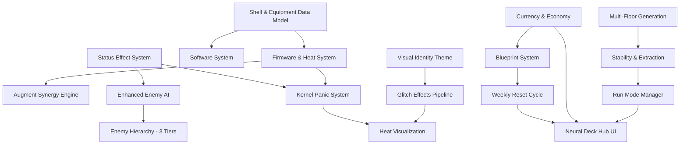

# Architecture Research: Nirmata Runner v2.0

## Existing Architecture

```
src/
├── engine/          # ECS core, event bus, grid, world, state machine
├── shared/          # Action pipeline, types, events shared client/server
├── game/            # Game-specific systems, setup, components, AI
├── rendering/       # PixiJS render system, animations, camera, FOV
├── ui/              # React components, Zustand stores
└── app/api/         # Next.js API routes (action validation)
```

**Key patterns:**
- Engine ← Game boundary (enforced by ESLint)
- Server-authoritative action pipeline (pure function, shared types)
- Event-driven communication (EventBus with typed events)
- JSON entity templates → builder → registry → factory

---

## New Components Needed

### 1. Equipment System (src/game/systems/)

**New Components:**
```
ShellComponent       { archetype, baseStats, ports: PortConfig }
PortConfig           { firmwareSlots: number, augmentSlots: number, softwareSlots: number }
FirmwareComponent    { abilityId, heatCost, effects, installed: boolean }
AugmentComponent     { augmentId, triggerType, triggerCondition, payload }
SoftwareComponent    { softwareId, modifier, magnitude, burnedOnto: EntityId | null }
HeatComponent        { current: number, max: number, ventRate: number }
LoadoutComponent     { shellId, firmware: EntityId[], augments: EntityId[], software: EntityId[] }
```

**New Systems:**
- `HeatSystem` — processes heat generation, dissipation, and venting per turn
- `FirmwareSystem` — handles ability activation, heat cost application, cooldown (if overloaded)
- `AugmentSystem` — listens for firmware events, evaluates trigger conditions, fires payloads
- `SoftwareSystem` — applies modifier effects to combat calculations
- `KernelPanicSystem` — evaluates overclock risk, rolls panic table, applies consequences

**Integration points:**
- FirmwareSystem emits `FIRMWARE_ACTIVATED` → AugmentSystem listens for trigger
- HeatSystem reads `HeatComponent` each post-turn → applies venting
- KernelPanicSystem runs after FirmwareSystem when heat > 100
- Combat system reads SoftwareComponent modifiers during damage calculation

### 2. Status Effect System (src/game/systems/)

**New Components:**
```
StatusEffectsComponent  { effects: StatusEffect[] }
StatusEffect            { type, duration, magnitude, source, visualId }
```

**Status effect types (from design docs):**
- `HUD_GLITCH` — HUD elements flicker/disappear (Null-Pointer enemy, Kernel Panic)
- `INPUT_LAG` — movement delay (Kernel Panic 121-140%)
- `FIRMWARE_LOCK` — all abilities disabled (Kernel Panic 141-160%)
- `CRITICAL_REBOOT` — Stability damage + stun (Kernel Panic 161%+)
- `FIRMWARE_COOLDOWN` — specific ability locked (Logic-Leaker enemy)
- `MOVEMENT_SLOW` — reduced movement (Buffer-Overflow enemy)
- `VISION_GRAYSCALE` — rendering filter change (Phase_Shift side effect)

**System:** `StatusEffectSystem` — ticks durations, applies/removes effects, emits events for rendering

### 3. Stability & Extraction (src/game/systems/)

**New Components:**
```
StabilityComponent      { current: number, max: number, drainRate: number }
FloorComponent          { depth: number, difficulty: number, seed: string }
ExtractionStateComponent { canExtract: boolean, anchorAvailable: boolean, lootManifest: ItemId[] }
```

**New Systems:**
- `StabilitySystem` — drains stability per floor, checks for zero (run ends)
- `ExtractionSystem` — manages Anchor interaction, Extract/Descend logic
- `FloorTransitionSystem` — generates next floor, places enemies/items, resets camera

**Data flow:**
```
Player reaches Anchor → ExtractionSystem pauses game → UI shows decision
  → Extract: End run, transfer loot to stash (server-validated)
  → Descend: Spend currency, refill stability, generate next floor
```

### 4. Economy & Persistence (src/game/economy/ + src/app/api/)

**New Components:**
```
WalletComponent         { scrap: number, blueprints: number, flux: number }
StashComponent          { items: ItemData[], maxSlots: number }
VaultComponent          { items: ItemData[], maxSlots: number, locked: boolean }
BlueprintLibrary        { blueprints: BlueprintData[], compiledIds: string[] }
```

**API Routes:**
```
POST /api/stash        — save/load stash
POST /api/economy      — currency transactions (server-validated)
POST /api/blueprints   — compile/install/weekly-reset
POST /api/leaderboard  — submit/query scores
GET  /api/season       — current week metadata, active seed, reset timestamp
```

**Integration:** All economy mutations go through the action pipeline (same pattern as combat actions).

### 5. Enhanced Enemy AI (src/game/systems/)

**New Components:**
```
EnemyTierComponent      { tier: 1 | 2 | 3, archetype: string }
SwarmComponent          { packId: string, role: 'leader' | 'follower' }
SpecialAttackComponent  { attackType, cooldown, currentCooldown, effect }
BossComponent           { phases: BossPhase[], currentPhase: number }
InvulnerableComponent   {} // Tag for System_Admin — cannot be killed
```

**New behavior states (extend existing AI):**
- `flanking` — Null-Pointer: try to get behind player
- `swarming` — Buffer-Overflow: surround player, detonate when adjacent
- `zone_control` — Fragmenter: create Dead Zones on slam
- `kiting` — Logic-Leaker: stay at max range, fire homing projectiles
- `stalking` — System_Admin: slow walk toward player, ignore damage
- `world_shift` — Seed_Eater: modify room layout during combat

**Slot-based positioning:** For swarm enemies, use "attack slots" around player to prevent stacking on same tile.

### 6. Run Mode Manager (src/game/modes/)

**New module:**
```
RunModeManager {
  mode: 'simulation' | 'daily' | 'weekly'
  seed: string
  rules: RunRules
  scoring: ScoringConfig
}

RunRules {
  shellType: 'virtual' | 'physical'
  lossOnDeath: LossConfig
  stabilityConfig: StabilityConfig
  maxFloors: number | null
}
```

**Integration:** RunModeManager configures the game setup before a run begins. Different rules for what's at risk, how scoring works, which Shell type is used.

### 7. Visual Effect Pipeline (src/rendering/)

**New systems:**
- `GlitchEffectSystem` — manages PixiJS filters based on game state (heat level, enemy proximity)
- `HeatVisualizerSystem` — maps heat level to visual corruption (HUD jitter, sprite ghosting)
- `TransitionSystem` — System Handshake animation at Anchors, floor transitions

**Filter chain:**
```
Normal → [Heat > 50: CRT scanlines] → [Heat > 75: Glitch displacement]
  → [Heat > 100: Color inversion] → [Heat > 140: Heavy screen-tear]
  → [Kernel Panic: Grayscale world]
```

---

## Suggested Build Order

Based on dependency analysis:



**Critical path:** Shell → Firmware/Heat → Augments → Kernel Panic → Enemy Hierarchy → Stability/Extraction → Run Modes → Hub UI

---
*Research completed: 2026-03-29*
