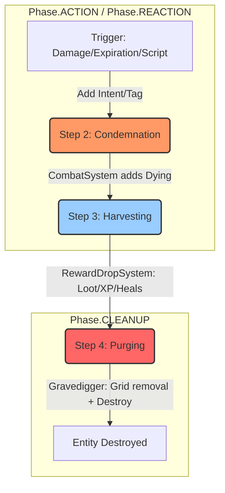

# Death Protocol: The "Dying" Pipeline

This document defines the canonical process for entity destruction in Nirmata Runner. To ensure simulation determinism, visual synchronization, and proper reward processing, all entity removals **must** follow this 4-step lifecycle.

## The Golden Rule of Death
**No system except the `GravediggerSystem` is allowed to call `world.destroyEntity()`.**

Any system that determines an entity should be removed (due to damage, expiration, or scripted events) must instead mark the entity with the `Dying` component.

---

## Architecture Overview



## The 4-Step Lifecycle

### 1. The Trigger (Intent/Event)
An entity's removal is triggered by an event or a component.
- **Damage**: A system adds a `DamageIntent` component to a target.
- **Expiration**: A timer or turn-counter reaches zero (e.g., `DeadZone`).
- **Self-Destruct**: An AI behavior or scripted event determines removal is necessary.

### 2. Condemnation (Marking as `Dying`)
The authoritative system for that trigger type processes the state and marks the entity.
- **CombatSystem**: Processes `AttackIntent` or `DamageIntent`. If `Health <= 0`, it adds the `Dying` component and emits `ENTITY_DIED`.
- **Environmental Systems**: If an entity expires, the system adds the `Dying` component directly.

### 3. Harvesting (Processing Reactions)
Once an entity has the `Dying` tag, but **before** it is destroyed, other systems in the `Phase.CLEANUP` cycle process it.
- **RewardDropSystem**: Queries for `Dying` entities. Rolls for Currency (Scrap/Flux) and Equipment (LootTable). Spawns items at the entity's position.
- **Reaction Systems**: Systems check for "On Kill" or "On Death" triggers (e.g., Vampire software healing the killer).
- **RunEnderSystem**: Checks if the Player has the `Dying` tag to trigger the Game Over sequence.

### 4. Purging (The Gravedigger)
The `GravediggerSystem` runs **last** in the `Phase.CLEANUP` cycle. 
1. It retrieves the `Position` of the `Dying` entity.
2. It calls `grid.removeEntity()` to clear the spatial index.
3. It calls `world.destroyEntity()` to permanently remove it from the ECS.

---

## Technical Specifications

### The `Dying` Component
```typescript
export const Dying = defineComponent('dying', z.object({
  killerId: z.number().optional(), // EntityId of the responsible party
  reason: z.string().optional()     // e.g., 'damage', 'expiration', 'extraction'
}));
```

### The `DamageIntent` Component
Use this to request damage without calculating it yourself. This ensures armor and defense logic are centralized.
```typescript
export const DamageIntent = defineComponent('damageIntent', z.object({
  targetId: z.number(),
  amount: z.number() // Raw damage before defense
}));
```

### Implementation Checklist
- [ ] **Never** call `grid.removeEntity()` or `world.destroyEntity()` in a combat or gameplay system.
- [ ] **Always** add the `Dying` component when health reaches zero.
- [ ] Ensure all "On Death" logic (loot, XP, cleanup) runs in `Phase.CLEANUP` **before** the Gravedigger.
- [ ] If you need to know who killed an entity, always pass the `killerId` in the `Dying` component.
