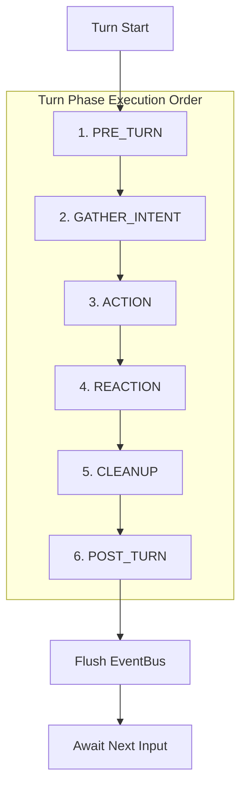
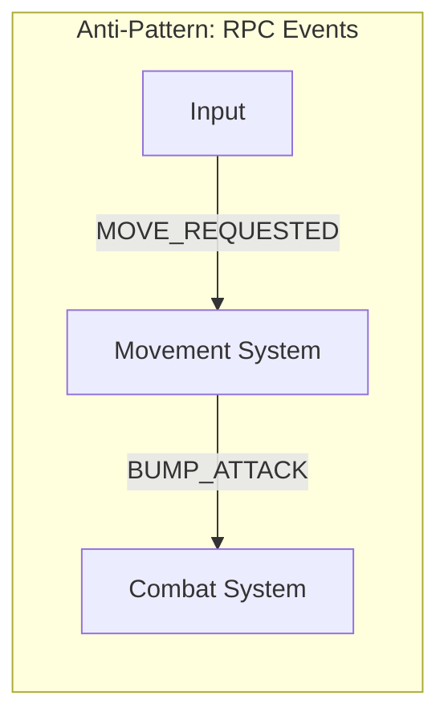
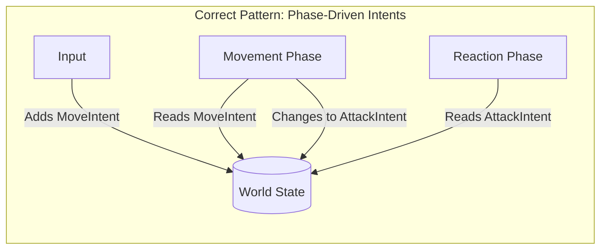

# Engine Architecture & ECS Guidelines

This document outlines the strict design patterns governing the Entity-Component-System (ECS) architecture in Nirmata Runner. Future features, components, and systems **must** adhere to these rules to maintain a predictable, serializable, and bug-free state machine.

## Core Philosophy: The Phase-Driven Intent Pattern

**The Golden Rule:** No internal system should ever emit an event to command another internal system to do something.

Any interaction that acts as a "Remote Procedure Call" (RPC) between systems is an anti-pattern. If System A wants System B to perform an action, System A must attach an **Intent Component** to the target entity. System B will then evaluate that Intent during its designated execution phase.

The `EventBus` is strictly reserved for crossing domain boundaries:
*   **Engine → UI**: Signaling the React UI to update (e.g., `SHELL_STATS_CHANGED`).
*   **Engine → Renderer**: Signaling PixiJS to play an animation (e.g., `ENTITY_MOVED`).
*   **Engine → Audio**: Signaling a sound effect.
*   **UI → Engine**: The player or external layer issuing a command (e.g., `ANCHOR_DECISION_MADE`).

---

## The Turn Lifecycle

The game state advances deterministically through the following phases orchestrated by the `TurnManager`. Every system must be registered to one of these phases via `world.registerSystem()`.



### Phase Definitions
1.  **`PRE_TURN`**: Upkeep. Resources accumulate or decay naturally (e.g., Heat dissipates). Status effect durations tick down.
2.  **`GATHER_INTENT`**: Decision making. AI systems evaluate the board and attach Intents (`MoveIntent`, `AttackIntent`) to their entities.
3.  **`ACTION`**: Primary resolution. Systems like Movement evaluate Intents. (e.g., If movement is blocked by an enemy, it removes the `MoveIntent` and attaches an `AttackIntent`).
4.  **`REACTION`**: Consequence resolution. Combat resolves `AttackIntent`. Triggered effects (e.g., "On Kill" augments) evaluate the resulting state.
5.  **`CLEANUP`**: Garbage collection. Systems process tags like `MovedThisTurn` or `Dying`. The final system (`GravediggerSystem`) calls `world.destroyEntity()`.
6.  **`POST_TURN`**: Environmental ticks (e.g., Dead Zones deal damage, Corruption spreads).
7.  **`RENDER`**: (Client-only) PixiJS updates visuals based on the finalized state.

---

## Patterns and Anti-Patterns

### 1. Requesting Actions (Intents vs. RPC)

Do not use the `EventBus` to string logic together. 





❌ **Anti-Pattern:**
```typescript
// System A
eventBus.emit('VENT_HEAT_REQUESTED', { entityId: 123 });

// System B (Listens anywhere)
eventBus.on('VENT_HEAT_REQUESTED', (payload) => { ... });
```

✅ **Correct Pattern:**
```typescript
// System A (Input/AI)
world.addComponent(entityId, VentIntent, {});

// System B (Heat System registered to Phase.ACTION)
export function update(world: World) {
  const ventingEntities = world.query(VentIntent);
  for (const id of ventingEntities) {
    // Process vent...
    world.removeComponent(id, VentIntent);
  }
}
```

### 2. Entity Destruction (The `Dying` Tag)

Entities cannot be destroyed mid-phase because other systems in the pipeline may still need to query their components (e.g., an "On Kill" augment needs to know the target's position or traits).

❌ **Anti-Pattern:**
```typescript
// Inside Combat System
if (health.current <= 0) {
  world.destroyEntity(entityId); // BAD! The entity ceases to exist immediately.
  eventBus.emit('ENTITY_DIED', { entityId }); // Other systems listening to this will find a null entity.
}
```

✅ **Correct Pattern:**
```typescript
// Inside Combat System (Phase.REACTION)
if (health.current <= 0) {
  world.addComponent(entityId, Dying, {}); 
}

// Inside RunEnder System (Phase.CLEANUP)
const dyingPlayers = world.query(Actor, Dying).filter(id => world.getComponent(id, Actor).isPlayer);
if (dyingPlayers.length > 0) { endGame(); }

// Inside Gravedigger System (Runs LAST in Phase.CLEANUP)
const dying = world.query(Dying);
for (const id of dying) {
  world.destroyEntity(id); // Safely purged at the very end of the tick
}
```

### 3. Component Mutation

The `World` store must be explicitly notified of data changes to trigger synchronization deltas (`json-diff-ts`) and server reconciliation. Direct object mutation bypasses this entirely.

❌ **Anti-Pattern:**
```typescript
const health = world.getComponent(entityId, Health);
health.current -= 5; // DANGER: State drift! The World doesn't know this changed.
```

✅ **Correct Pattern:**
```typescript
// Method 1: Patching (Preferred for partial updates)
world.patchComponent(entityId, Health, { current: Math.max(0, health.current - 5) });

// Method 2: Full replacement
const health = world.getComponent(entityId, Health);
world.addComponent(entityId, Health, { ...health, current: health.current - 5 });
```

### 4. Responding to External Signals

The `EventBus` signals the external world what just happened. If a system needs to react to something (like damage dealt), it should hook into the Phase execution, not the `EventBus`.

❌ **Anti-Pattern:**
```typescript
// augment.ts listening to combat
eventBus.on('DAMAGE_DEALT', (payload) => {
  if (playerHasVampireAugment) { healPlayer(); }
});
```

✅ **Correct Pattern:**
```typescript
// augment.ts registered to Phase.REACTION (runs AFTER combat)
export function update(world: World) {
  // Query intents/state left behind by the Combat system
  const dyingEnemies = world.query(Dying);
  if (dyingEnemies.length > 0 && playerHasVampireAugment) {
    healPlayer();
  }
}
```

---

## Summary Checklist for New Systems

When creating a new feature in Nirmata Runner:
1. [ ] **Does it require state?** Define a strict Zod schema in `src/shared/components/`.
2. [ ] **Does it require an action?** Define an `Intent` component (e.g., `MoveIntent`).
3. [ ] **When does it happen?** Pick a specific `Phase` enum value and register the system in `engine-factory.ts`.
4. [ ] **Does it mutate data?** Use `world.patchComponent()`.
5. [ ] **Does the UI need to see it?** Emit an event to `GameEvents` or `GameplayEvents`, but ensure no internal system uses `eventBus.on()` to listen to it.
